# Aldaba — Modelo de datos (Entidad–Relación)

Base **Cloudflare D1 (SQLite)** · binding `DB` · versionada con `wrangler d1 migrations`
(`worker/migrations/0001…0006`). **31 tablas**, todas multi-tenant por `condominio_id`, con
claves foráneas, `CHECK`, `UNIQUE`, índices y triggers de rango. Esquema consolidado y legible en
[`esquema-consolidado.sql`](./esquema-consolidado.sql).

## Jerarquía

```
organización → condominio → torre → unidad → residente(s)
                    │
                    ├── finanzas (cuotas · pagos · gastos · multas)
                    ├── accesos  (pases · visitas · paquetes · SOS · rondas)
                    ├── comunidad (áreas · reservas · votaciones · tickets · directorio)
                    ├── comunicados (+ lecturas)
                    └── CRM/mensajería (notas · plantillas · mensajes)
```

Toda acción sensible se registra en **`eventos`** (auditoría universal: quién, qué, cuándo, en qué condominio).

## Diagrama entidad–relación

```mermaid
erDiagram
  organizaciones ||--o{ condominios : agrupa
  condominios   ||--o{ torres : contiene
  condominios   ||--o{ unidades : contiene
  torres        ||--o{ unidades : agrupa
  usuarios      ||--o{ membresias : tiene
  condominios   ||--o{ membresias : incluye
  unidades      ||--o{ membresias : asigna
  condominios   ||--o{ invitaciones : emite
  unidades      ||--o{ invitaciones : para
  usuarios      ||--o{ sesiones : abre
  condominios   ||--o{ comunicados : publica
  comunicados   ||--o{ lecturas_comunicado : recibe
  usuarios      ||--o{ lecturas_comunicado : marca
  condominios   ||--o{ cuotas : emite
  unidades      ||--o{ cuotas : debe
  condominios   ||--o{ pagos : recibe
  unidades      ||--o{ pagos : reporta
  condominios   ||--o{ gastos : registra
  condominios   ||--o{ multas : aplica
  unidades      ||--o{ multas : recibe
  condominios   ||--o{ pases_visita : genera
  unidades      ||--o{ pases_visita : desde
  pases_visita  ||--o{ visitas_log : produce
  condominios   ||--o{ visitas_log : bitacora
  condominios   ||--o{ paquetes : custodia
  unidades      ||--o{ paquetes : para
  condominios   ||--o{ sos_alertas : recibe
  condominios   ||--o{ rondas : registra
  condominios   ||--o{ areas_comunes : ofrece
  areas_comunes ||--o{ reservas : agenda
  condominios   ||--o{ reservas : incluye
  unidades      ||--o{ reservas : solicita
  condominios   ||--o{ votaciones : abre
  votaciones    ||--o{ opciones_voto : tiene
  opciones_voto ||--o{ votos : recibe
  usuarios      ||--o{ votos : emite
  condominios   ||--o{ tickets : reporta
  condominios   ||--o{ directorio : lista
  condominios   ||--o{ notas_crm : anota
  unidades      ||--o{ notas_crm : sobre
  condominios   ||--o{ plantillas : guarda
  condominios   ||--o{ mensajes : envia
  condominios   ||--o{ eventos : audita

  organizaciones { TEXT id PK  TEXT nombre }
  condominios { TEXT id PK  TEXT organizacion_id FK  TEXT nombre  REAL tasa_bs  INT suspendido }
  torres { TEXT id PK  TEXT condominio_id FK  TEXT nombre }
  unidades { TEXT id PK  TEXT condominio_id FK  TEXT torre_id FK  TEXT nombre  REAL alicuota }
  usuarios { TEXT id PK  TEXT email UK  TEXT nombre  TEXT hash  TEXT telefono  INT es_superadmin }
  membresias { TEXT id PK  TEXT usuario_id FK  TEXT condominio_id FK  TEXT unidad_id FK  TEXT rol }
  invitaciones { TEXT token PK  TEXT condominio_id FK  TEXT unidad_id FK  TEXT rol  INT usada  TEXT creado_por FK }
  sesiones { TEXT id PK  TEXT usuario_id FK  TEXT expira }
  comunicados { TEXT id PK  TEXT condominio_id FK  TEXT titulo  TEXT cuerpo  TEXT creado_por FK }
  lecturas_comunicado { TEXT comunicado_id PK  TEXT usuario_id PK }
  cuotas { TEXT id PK  TEXT condominio_id FK  TEXT unidad_id FK  TEXT periodo  REAL monto_usd }
  pagos { TEXT id PK  TEXT condominio_id FK  TEXT unidad_id FK  REAL monto_usd  TEXT estado }
  gastos { TEXT id PK  TEXT condominio_id FK  TEXT tipo  TEXT categoria  REAL monto_usd  TEXT factura_key }
  multas { TEXT id PK  TEXT condominio_id FK  TEXT unidad_id FK  TEXT tipo  REAL monto_usd  TEXT estado }
  pases_visita { TEXT token PK  TEXT condominio_id FK  TEXT unidad_id FK  TEXT visitante  TEXT expira }
  visitas_log { TEXT id PK  TEXT condominio_id FK  TEXT pase_token FK  TEXT tipo  TEXT estado }
  paquetes { TEXT id PK  TEXT condominio_id FK  TEXT unidad_id FK  TEXT estado }
  sos_alertas { TEXT id PK  TEXT condominio_id FK  TEXT usuario_id FK  TEXT estado }
  rondas { TEXT id PK  TEXT condominio_id FK  TEXT guardia_id FK  TEXT checkpoint }
  areas_comunes { TEXT id PK  TEXT condominio_id FK  TEXT nombre  INT aforo  REAL costo_usd }
  reservas { TEXT id PK  TEXT condominio_id FK  TEXT area_id FK  TEXT unidad_id FK  TEXT estado }
  votaciones { TEXT id PK  TEXT condominio_id FK  TEXT titulo  TEXT estado }
  opciones_voto { TEXT id PK  TEXT votacion_id FK  TEXT texto }
  votos { TEXT id PK  TEXT votacion_id FK  TEXT opcion_id FK  TEXT usuario_id FK  REAL peso }
  tickets { TEXT id PK  TEXT condominio_id FK  TEXT usuario_id FK  TEXT titulo  TEXT estado }
  directorio { TEXT id PK  TEXT condominio_id FK  TEXT nombre  TEXT telefono }
  notas_crm { TEXT id PK  TEXT condominio_id FK  TEXT unidad_id FK  TEXT texto }
  plantillas { TEXT id PK  TEXT condominio_id FK  TEXT nombre  TEXT cuerpo }
  mensajes { TEXT id PK  TEXT condominio_id FK  TEXT canal  INT destinatarios }
  eventos { INT id PK  TEXT condominio_id  TEXT actor_id  TEXT tipo  TEXT datos }
```



## Catálogo de tablas

### Núcleo y tenencia (`0001` + `0002`)
| Tabla | Propósito | Claves / reglas |
|---|---|---|
| `organizaciones` | Administradora o junta | `UNIQUE(nombre)` |
| `condominios` | Edificio/condominio (tenant) | FK→organizaciones · `tasa_bs≥0` (trigger) · `UNIQUE(organizacion_id,nombre)` |
| `torres` | Torre dentro de un condominio | FK→condominios · `UNIQUE(condominio_id,nombre)` |
| `unidades` | Apto/local | FK→condominios,torres · `alicuota≥0` (trigger) · `UNIQUE(condominio_id,torre_id,nombre)` + índice parcial sin-torre |
| `usuarios` | Personas (login) | `email UNIQUE COLLATE NOCASE` · `hash` PBKDF2 · `telefono` · `es_superadmin` |
| `membresias` | Acceso: usuario × condominio × unidad × **rol** | `rol CHECK(org_admin/admin/porteria/residente)` · UNIQUE + índice parcial para roles sin unidad |
| `invitaciones` | Token de alta (un uso) | FK→condominios,unidades · `creado_por` · `expira` |
| `sesiones` | Sesión (cookie HMAC) | FK→usuarios · `expira` · índice en expira |
| `login_intentos` | Rate-limit de login | ventana + contador |
| `comunicados` / `lecturas_comunicado` | Cartelera y % de lectura | FK→condominios,usuarios · PK compuesta en lecturas |
| `eventos` | **Auditoría universal** | `condominio_id`, `actor_id`, `tipo`, `datos` (sin FK: sobrevive a sus referentes) |

### Finanzas / tesorería (`0003` + multas en `0006`)
| Tabla | Propósito | Reglas |
|---|---|---|
| `cuotas` | Cuota emitida a una unidad por período | `monto_usd≥0` · `UNIQUE(unidad,periodo,concepto)` |
| `pagos` | Pago reportado→**aprobado/rechazado** | `estado CHECK` · `reportado_por`/`conciliado_por` |
| `gastos` | Egreso **gasto/compra** con factura (R2) | `tipo/categoria CHECK` · `factura_key` |
| `multas` | Multa (suma a morosidad) / amonestación | `tipo CHECK(multa/amonestacion)` · `estado` |

### Accesos y seguridad (`0004`)
`pases_visita` (QR) → `visitas_log` (bitácora: qr/sincita/delivery, estado ingreso/denegado/pendiente) · `paquetes` (custodia→entregado) · `sos_alertas` (activa→atendida→resuelta) · `rondas` (checkpoints).

### Comunidad (`0005`)
`areas_comunes` → `reservas` (solicitada→aprobada/rechazada) · `votaciones` → `opciones_voto` → `votos` (**ponderados por alícuota**, `UNIQUE(votacion,usuario)` = 1 voto/persona) · `tickets` (abierto→en_curso→resuelto) · `directorio`.

### CRM / mensajería (`0006`)
`notas_crm` (notas por unidad) · `plantillas` (mensajería) · `mensajes` (campañas WhatsApp/correo, auditoría de envío).

## Principios de diseño
- **Multi-tenant estricto:** toda tabla de negocio lleva `condominio_id`; un middleware de tenencia obligatorio inyecta el scope y ningún handler consulta D1 sin pasar por él.
- **Integridad:** FKs declaradas (D1 las aplica), `CHECK` de enums y rangos, `UNIQUE` de invariantes, índices que cubren las queries reales.
- **Migraciones versionadas:** el esquema evoluciona con archivos numerados; los tests aplican las **mismas** migraciones que producción (`applyD1Migrations`).
- **Auditoría:** cada mutación sensible deja rastro en `eventos` con actor.
- **Dinero:** `monto_usd` en USD; `condominios.tasa_bs` convierte a Bs en la capa de presentación.
